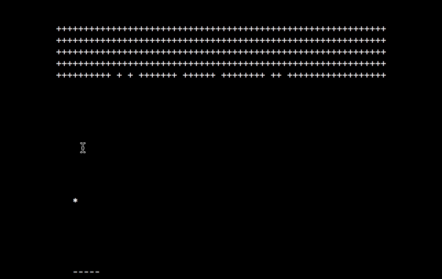

# Breakout using ncurses

Japanese document is available [here](https://qiita.com/kaityo256/items/80863d466e0d69808eb9).

## Summary

Breakout implemented with using ncurses.

## Usage

    cd step5
    make
    make run

Enjoy!
